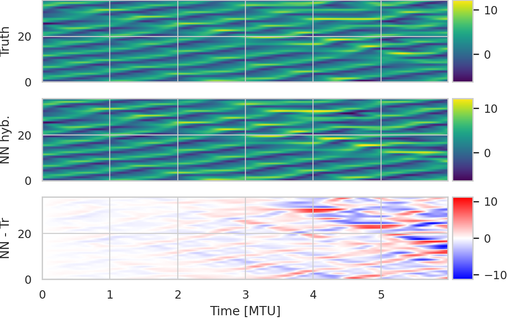
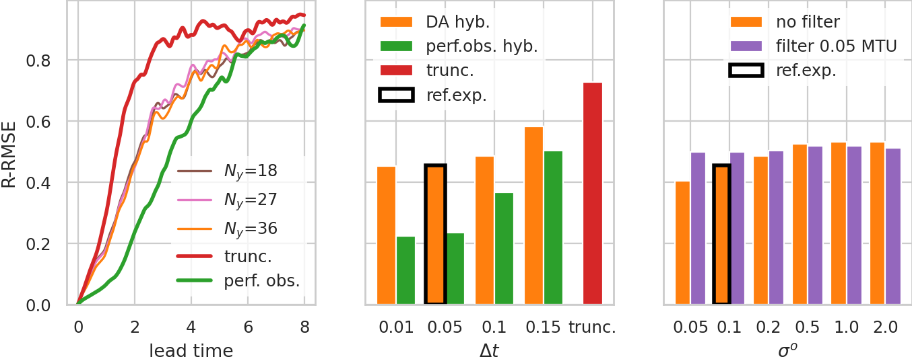

# Run the experiments of the Lorenz 2 scale model

## Configuration
You can change the [config/paths.yml](config/paths.yml) to set the directory where to save the data
(around 20 Go of space needed).

## Reproduce the figures of the paper
You can reproduce Fig.1 and Fig.2 of the article by running the notebooks [philtra-figure1](philtra-figure1.ipynb) and [philtra-figure2](philtra-figure2.ipynb). In the notebooks, you have the option to either download the data from ftp or to compute the data locally. To compute the data necessary for the figure 1, run the reference simulation (see the [Light run section](#light-run:-the-reference-simulation) ). To compute the data needed for Fig. 2, run the sensitivy experiments (see the [Long run section](#long-run:-all-the-simulations) ). Warning, the sensitivity experiment is long to run (typically 2 days).
 
 

## Light run: the reference simulation
You can test the algorithm by running only the reference experiment (used to produce Fig.1 of the article).
For simplicity, it advised to run the jupyter notebook, but it is possible to run it in a terminal using directly the scripts (see the [Long run section](#long-run:-all-the-simulations) )

After each notebook execution, you can use the notebook [Check-experiment](check-experiment.ipynb) to check the outputs produced (see the detail instructions in the corresponding notebooks).

Here the jupyter notebook to run in the following order:\
- [1.simul-physical-models](1.simul-physical-models.ipynb)
- [2.compute-trainingset](2.compute-trainingset.ipynb)
- [3.training-NN.ipynb](3.training-NN.ipynb)
- [4.simul_hybrid-models.ipynb](4.simul-hybrid-models.ipynb)


## Long run: all the simulations
Running all the simulation needed to produce Fig. 2 of the paper is more computational demanding (around 2 days of computation on a normal PC and 20 Go of space needed).\
It is advised to run it directly using the scripts in a terminal but it is also possible to use the notebook as for the the reference simualation. You just have to modifiy the parameter file to be used in the arguments (sens_train.yml instead of ref_train.yml, sens_test.yml instead of ref_test.yml, etc.)

Here are the scripts to run in the following order:

Training true simulation:\
```python simul.py --paths config/paths.yml --params config/sens_train.yml --model config/model_true.yml```

Training truncated simulation:\
```python simul.py --paths config/paths.yml --params config/sens_train.yml --model config/model_trunc.yml```

Testing true simulation:\
```python simul.py --paths config/paths.yml --params config/sens_test.yml --model config/model_true.yml```

Testing truncated simulation:\
```python simul.py --paths config/paths.yml --params config/sens_test.yml --model config/model_trunc.yml```

Compute the training set with noisy/sparse observation (using DA):\
```python compute_trainingset.py --paths config/paths.yml --params config/sens_train.yml --model config/model_trunc.yml```

Compute the training set with perfect observation (no DA):\
```python compute_trainingset.py --paths config/paths.yml --params config/sens_train_po.yml --model config/model_trunc.yml```

Train the NN with noisy/sparse observation:\
```python train.py --paths config/paths.yml --params config/sens_train.yml```

Train the NN with perfect observation:\
```python train.py --paths config/paths.yml --params config/sens_train_po.yml```

Testing hybrid simulation:\
```python simul.py --paths config/paths.yml --params config/sens_test.yml --model config/model_hybrid.yml```


Testing hybrid simulation with perfect observations:\
```python simul.py --paths config/paths.yml --params config/sens_test_po.yml --model config/model_hybrid.yml```
