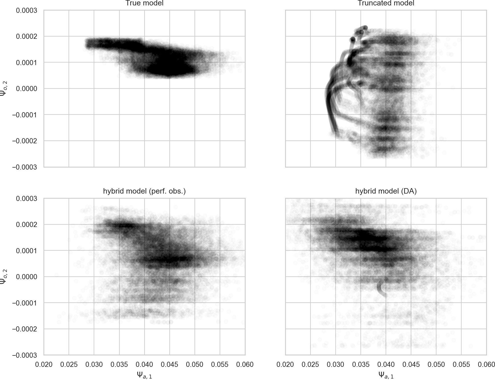

# Plot the figures for the MAOOAM application

## Reproduce the figures of the paper
You can reproduce  Fig.3, Table 3 and Table 4 of the article by running the notebook [philtra-maooam](philtra-maooam.ipynb). In the notebook, you have the option to either download the data from ftp or to compute the data locally. The first time you run the notebook, you must chose to download it from ftp.
 
